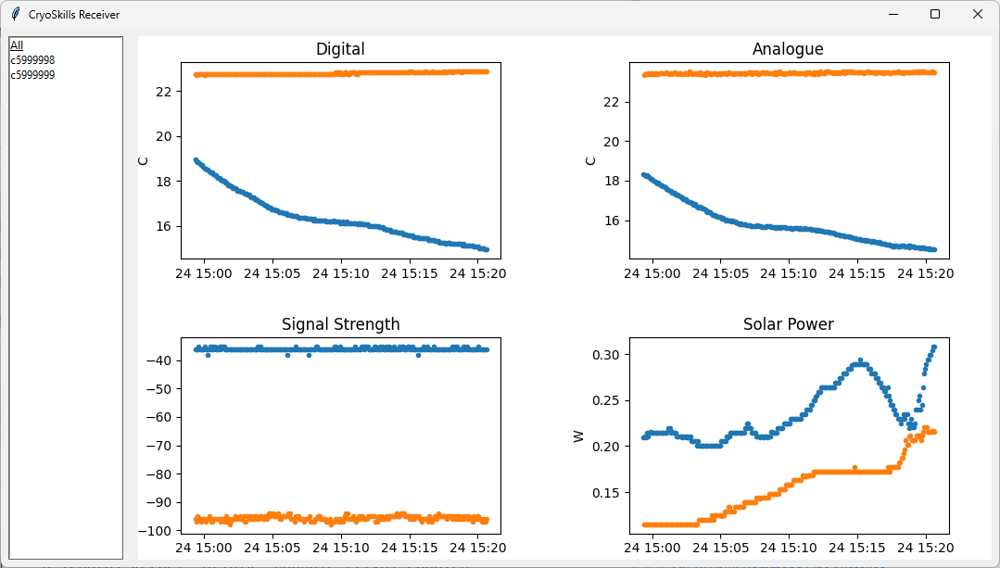

# CryoSkills Datalogger - Receiver (Software)
Graphical user interface for the CryoSkills datalogger receiver to log and display CryoSkills Sensor Kit LoRa packets in real-time.

The code has been tested with Python 3.12.0.

## Running the Receiver
If you have not installed the `cryoskills-receiver` software, follow the [installation instructions][#Installation] below.

To run the receiver, activate the virtual environment substitute the port name/path that your receiver is connected to and enter the command below.  If you are not sure which port your receiver is connected to, use the Device Manager (Windows) or run `dmesg | grep tty` on Unix systems.

```
cryoskills-receiver --port [COM??] 
```

There are three optional arguments for the receiver software:

| Argument Name | Description                       | Default                              | Example                     |
| ------------- | --------------------------------- | ------------------------------------ | --------------------------- |
| Port Name     | Serial port identifier.           | `COM12`                              | `--port COM12`              |
| Baud Rate     | Baud rate for the receiver.       | `9600`                               | `--baud 9600`               |
| Filename      | Path to save received packets to. | `cryoskills_log_yyyymmdd_HHMMSS.csv` | `--filename my_packets.csv` | 

### Screenshot



## Installation
We recommend using a Python virtual environment when installing the receiver GUI software with `pip`. 

### 1. Python Installation
If you don't have an existing installation of Python on your PC, you can install it from the [Python website](https://www.python.org/downloads/).  We recommend you install Version 3.12.

Once you have installed Python, make sure that it is added to your system `PATH` variable - **keep a note of the installation folder for this!**.

### 2. Virtual Environment Setup
Once you have installed Python, select a folder on your PC to install the `cryoskills-receiver` software.

As an example, we will be installing to `C:\Users\jono\cryoskills_receiver`.  If the directory doesn't already exist, create the folder by entering the following commands into a terminal or command prompt:

```
mkdir C:\Users\jono\cryoskills_receiver
cd C:\Users\jono\cryoskills_receiver
```

To avoid changing your default system Python installation, we'll create a virtual environment.  To do this:

```
python -m pip install virtualenv
python -m venv .env
```

Once the virtual environment has been created, you can activate it with the following command:

**WINDOWS**
```
.\env\Scripts\activate
```
**UNIX/MAC**
```
./env/bin/activate
```

### 3. Receiver Installation
With the virtual environment activated, you can install the `cryoskills-receiver` software using PIP with the following command. This should automatically resolve any dependencies for other Python packages and install them too.

```
pip install git+https://github.com/cryoskills/sensor-kit-receiver-gui
```
